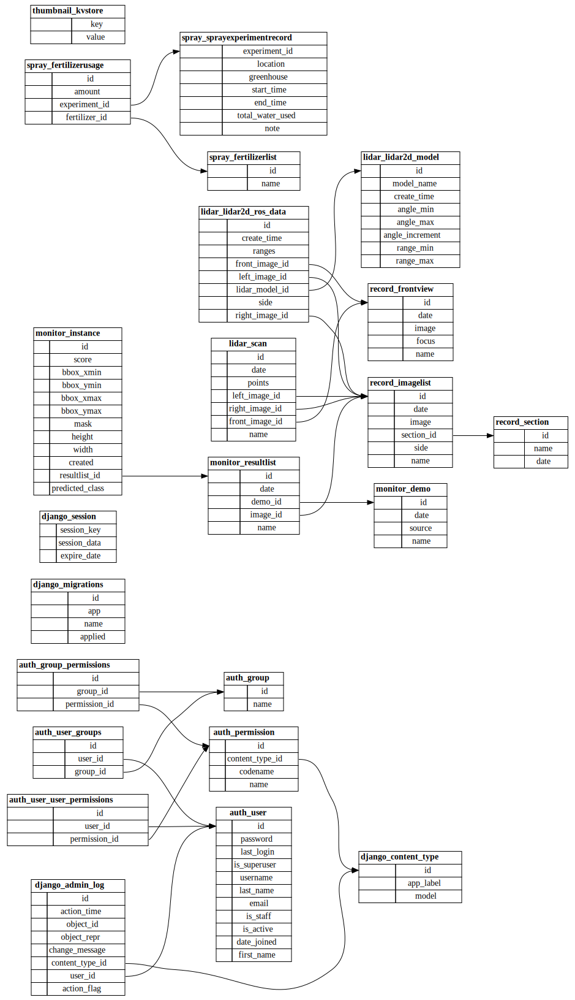

# django_asparagus
Asparagus monitoring system implemented using django

http://digiag.bime.ntu.edu.tw:3000/

## Home
Home page of the system.

## Record
Display the stored image data of each section and perform model detection.
* Front view of the field robot vehicle
* Demo range selection
* 2d array of buttons representing the sections in the field

## Monitor
Demonstrate detailed model detection results
1. User selects the interested detection result and the specific section from the left hand side
2. Then the detection result will be overlayed on the original image with SVG polygon and rect.
   Each SVG element is clickable and the detailed detection results will show on the right hand side
3. If the clicked target is "spear", and scale is detected, the growth model for spear length prediction will be activated in the Toast.

## Stats
Statistical analysis for the detection results.
1. User select the range of demos from the first two Selects.
2. After the calculation finished, user can then select the categry from the third select.
3. Also, if the spear is selected, the length prediction feature will also be available.

## Lidar
Store the 2D LiDAR data in ROS2 sensor_msgs/msg/LaserScan Message format. Robot vehicle is required.
* Deal with multiple LiDAR models, not specific to a certain product.
* Auto related to the left, right and front view images of the robot in the same monitoring point, based on the timestamp.

## API
ORM query the resaltlist database for the each section poind density for the fertilizer variable spraying.

## Spray
Store and display the spray data of the automation spraying robot.
* Store History of the spray data, including the spray time, location, fertilizer type and the amount of fertilizer,
* Manual refresh for the latest spraying robot information.

## Admin
Admin page for accessing the database.

## Database Table Design

