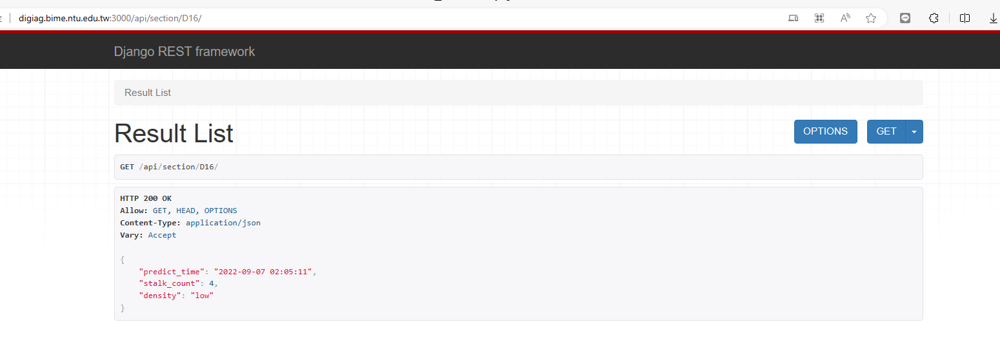
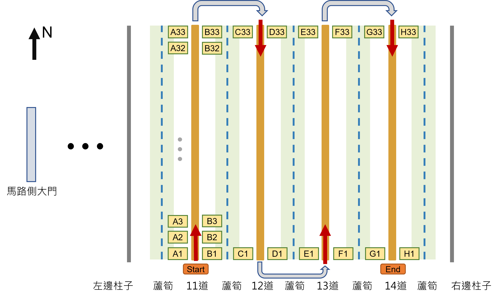

# 密度辨識API使用

## Batch search

用途: 查詢單一批次辨識的所有結果的API，若全部辨識完成，可以使用此機制將所有結果一次抓取下來。

網址: [http://digiag.bime.ntu.edu.tw:3000/api/batch/398/](http://digiag.bime.ntu.edu.tw:3000/api/batch/398/)

最後的398是我們這邊辨識結果資料庫中的ID，可以由這個[影片](https://www.notion.so/API-To-f7777b9e82334f58829aa63ef85bbfcc?pvs=21)中的操作方式取得辨識ID，這個數值不會被更改，可以先用398這組數據測試，這組的資料是第一條走道兩側，也就是A1~B33的結果，得到的應該會是一個json檔案，可以用result["A1"]["density]方式直接查詢單一位置的密度，

## 單點查詢

**主要網址:**

[http://digiag.bime.ntu.edu.tw:3000/api/section/D15/](http://digiag.bime.ntu.edu.tw:3000/api/section/D15/)
  (注意最後的反斜線)

前面網址固定，透過修改最後section編號得到該區域的最新辨識結果(區域編號說明[如下](readme_imgs/section.png))，並且提供辨識數量與密度


💡 查詢方式舉例如下:

[http://digiag.bime.ntu.edu.tw:3000/api/section/D16/](http://digiag.bime.ntu.edu.tw:3000/api/section/D16/)

[http://digiag.bime.ntu.edu.tw:3000/api/section/F33/](http://digiag.bime.ntu.edu.tw:3000/api/section/D16/)

[http://digiag.bime.ntu.edu.tw:3000/api/section/A2/](http://digiag.bime.ntu.edu.tw:3000/api/section/D16/)




透過任一可執行http request的工具(如python, 瀏覽器等)利用GET方式訪問此網址，可取得json格式之結果

- Sample code

    ```python
    import requests

    api_url = "http://digiag.bime.ntu.edu.tw:3000/api/section/D15/"
    response = requests.get(api_url)

    if response.status_code == 200:
        data = response.json()
        print(data)
    else:
        print("Request failed with status code:", response.status_code)

    =======================================================================
    {'predict_time': '2022-09-07 02:05:14', 'stalk_count': 8, 'density': 'low'}
    ```


**細節說明**

- predict time: 進行辨識的時間，可用來確認是否為此次實驗進行
- stalk_count: 該照片中由模型辨識後得到母莖的數量(照片橫向視野範圍: 約100cm)
- density: 由上述母莖數量根據以下結果定義為三個密度等級，確切數值可再調整
    - high: >25
    - medium: 15~25
    - low: <15

## 場域分區說明

地點: 義竹分場B4溫室，第11~14道走道

說明: 車子依據UWB座標每公尺定點停止並拍照記錄，定點編號(section)如下圖所示，編排從A1~H33透過API查詢特定section座標即可得到該位置的最新一次辨識結果，目前查詢的結果應會是先前辨識的數據，後續會再更新提供測試



分區的具體座標是由皮尺量測，於程式中設定座標為以下，setpoint1表示第11道，setpoint2表示第12道，以此類推。當車輛讀取到的UWB Y座標超過設定值時便停止車輛並進行拍照辨識。

```python
setpoint1 = create_setpoint(x=2.2,  y_start=4,  y_stop=36, step=1)    # [[2.2,4],   [2.2,5],   ... [2.2,36]]
setpoint2 = create_setpoint(x=3.82, y_start=36, y_stop=4,  step=-1)   # [[3.82,36], [3.82,35], ... [3.82,4]]
setpoint3 = create_setpoint(x=5.57, y_start=4,  y_stop=36, step=1)    # [[5.57,4],  [5.57,5],  ... [5.57,36]]
setpoint4 = create_setpoint(x=7.43, y_start=36, y_stop=4,  step=-1)   # [[7.43,36], [7.43,35], ... [7.43,4]]

def create_setpoint(x, y_start, y_stop, step):
    """
    Creates a set of coordinate points as a list of lists, given an x-coordinate and a range of y-coordinates.

    Args:
        x (float): the x-coordinate for all points
        y_start (int): the starting y-coordinate
        y_stop (int): the ending y-coordinate
        step (int): the step size between each point; either 1 or -1, 1 for forward, -1 for inverse.

    Returns:
        A list of coordinate points as lists of [x, y], sorted in ascending order if step is 1, or in descending order
        if step is -1.
    """
    if step == 1:
        # if step is positive, create a list of coordinate points with y-coordinates in ascending order
        return [[x, y] for y in range(y_start, y_stop + 1, step)]
    elif step == -1:
        # if step is negative, create a list of coordinate points with y-coordinates in descending order
        return [[x, y] for y in range(y_start, y_stop - 1, step)]
```