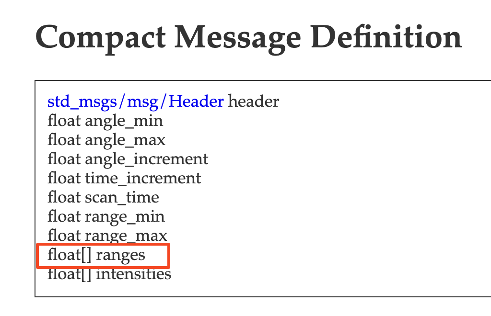
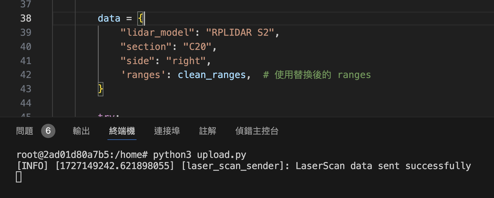
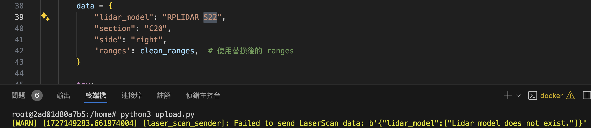
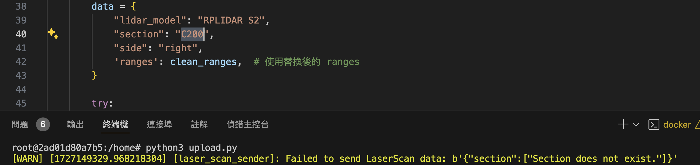
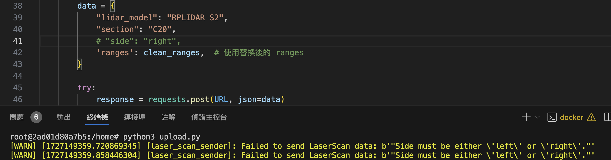

# 光達資訊上傳API (To 佐翼)

### **LaserScan Message**



僅需提供其中的ranges距離資料就好，其餘固定資訊已儲存在資料庫中

### **上傳網址：**

[http://digiag.bime.ntu.edu.tw:3000/lidar/lidar2dData/](http://digiag.bime.ntu.edu.tw:3000/lidar/lidar2dData/)

參數：

**`lidar_model`** ：str，光達型號，根據之前詢問結果您們是使用RPLIDAR S2這顆光達，因此輸入`”RPLIDAR S2"`即可

**`section`**：str，監測點的編號，與影像上傳用的編號規則相同，左右各自代表不同的位置，A1-A36, B1-B36, … , H1-H36

**`side`** ：str，記錄這筆資料屬於左側or右側的光達資料，僅可填入`”left”` / `“right”`。此參數會作為影像與光達對應的依據

**`ranges`**：list，記錄光達的各點深度資料，以python list形式上傳

## 使用方式

1. ROS bag play

    使用rosbag 檔案
    ```bash
    ros2 bag play -l rosbag2_2024_08_23-09_03_23_0.db3
    ```

2. 上傳資料，提供範例程式
    - upload.py

        ```python
        # upload.py

        import numpy as np
        from datetime import datetime

        import rclpy
        from rclpy.node import Node
        import requests
        from sensor_msgs.msg import LaserScan

        URL = "http://digiag.bime.ntu.edu.tw:3000/lidar/lidar2dData/"

        class LaserScanSender(Node):
            def __init__(self):
                super().__init__('laser_scan_sender')
                self.subscription = self.create_subscription(
                    LaserScan,
                    '/scan_l',
                    self.laser_scan_callback,
                    10)
                self.subscription
                self.has_sent = False  # 旗標變數，追蹤是否已經上傳過訊息

            def clean_range_data(self, ranges):
                arr = np.array(ranges)
                arr = np.nan_to_num(arr, posinf=65.533)
                arr = [float(f"{x:.5f}") for x in arr] # 確保小數點後最多5位
                return arr

            def laser_scan_callback(self, scan_data):
                if self.has_sent:
                    return  # 如果已經上傳過訊息，直接返回

                # 資料庫格式設計上的問題，將 inf 值替換為 65.533 這個不可能出現的數值，配合我們的光達資料
                clean_ranges = self.clean_range_data(scan_data.ranges)

                data = {
                    "lidar_model": "RPLIDAR S2",
                    "section": "C20",
                    "side": "left",
                    'ranges': clean_ranges,  # 使用替換後的 ranges
                }

                try:
                    response = requests.post(URL, json=data)
                    if response.status_code == 200:
                        self.get_logger().info("LaserScan data sent successfully")
                        self.has_sent = True  # 設置旗標為True，表示已經上傳過訊息
                    else:
                        self.get_logger().warn(f"Failed to send LaserScan data: {response.content}")
                except requests.exceptions.RequestException as e:
                    self.get_logger().error(f"Request failed: {e}")

        def main(args=None):
            rclpy.init(args=args)
            laser_scan_sender = LaserScanSender()
            rclpy.spin(laser_scan_sender)
            laser_scan_sender.destroy_node()
            rclpy.shutdown()

        if __name__ == '__main__':
            main()
        ```


    ```bash
    python3 upload.py
    ```

    由於我們對ROS2系統操作並未相當理解，因此只先提供個可初步達到功能的程式，目前程式會訂閱`/scan_l` 的訊息資料，並且上傳一次資料至伺服器，但需自行將程式 Ctrl + C 終止，相信您們的專業可以將它更好的整合進ROS架構中。

    其中有幾點要注意，

    1. 由於讀取的range原始資料小數點後位數相當多，並且有32400個點，考量資料儲存與有效位數後，需要將資料進行四捨五入至小數點後五位就好。
    2. 超出lidar有效範圍的資料會被記錄為inf，考量到資料儲存格式上與使用方便的問題，定義超過有效範圍的數值都轉換為65.533這個不可能出現的數值，此數值也是配合我們的光達超出距離的資料形態，以利後續資料存檔與使用。

        ```python
          def clean_range_data(self, ranges):
              arr = np.array(ranges)
              arr = np.nan_to_num(arr, posinf=65.533)
              arr = [float(f"{x:.5f}") for x in arr] # 確保小數點後最多5位
              return arr
        ```


    ## 資料驗證

    網頁資料驗證有設定些格式與資料檢查，再請根據錯誤訊息檢查資料。

    假如上傳成功：

    

    ### 型號提供錯誤

    

    ### section 錯誤

    


    ### 沒有提供side參數

    