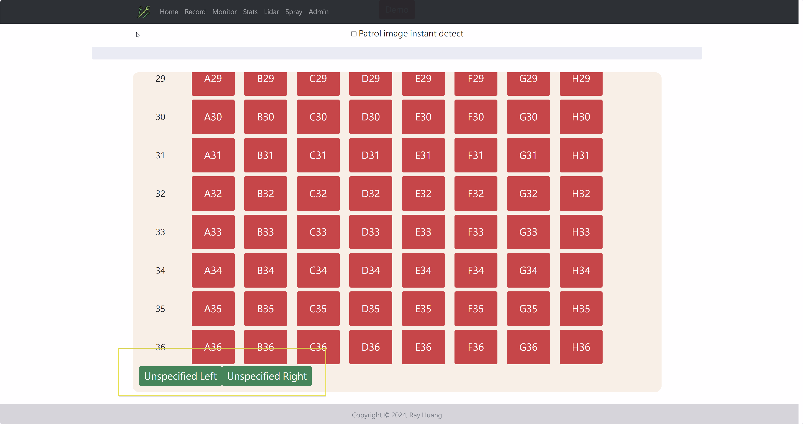
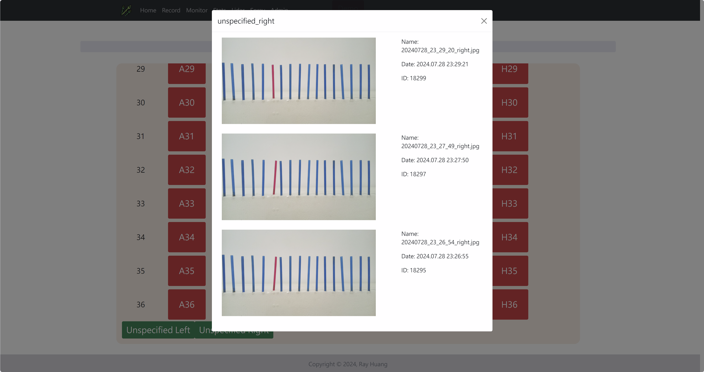
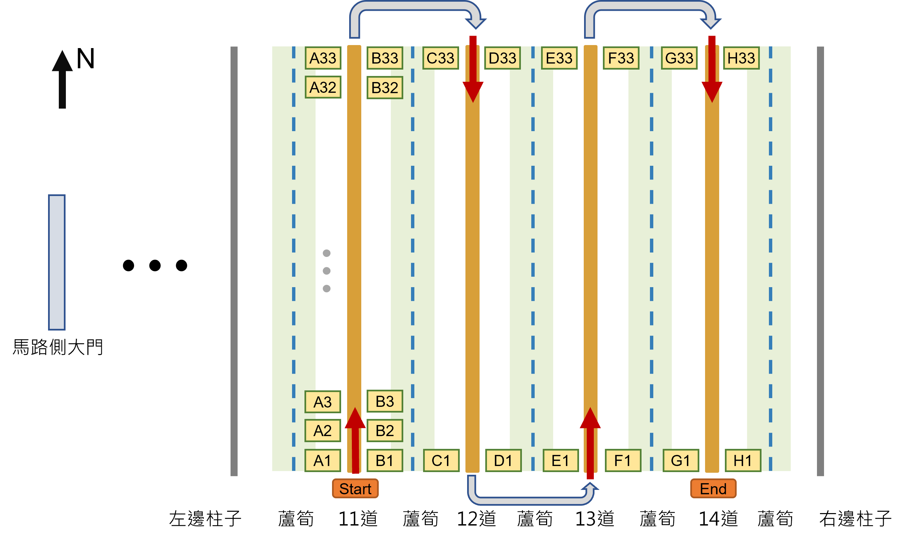
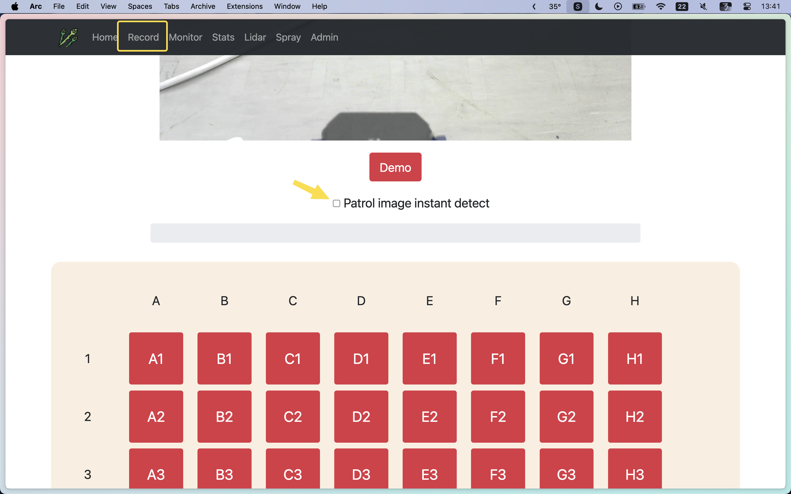

# 蘆筍生長影像上傳與辨識API (To 佐翼)

> 更新紀錄:
20240905: 新增[`side`]參數，以便得知照片為左側或是右側，並相應修改code內容(包含修正with open image語法)
>

## 影像上傳

影像尺寸限制：由於顯示卡VRAM與模型架構限制，解析度太高的照片無法順利進行辨識，因此請在上傳前將照片適當的縮小解析度。經我們測試16:9的照片需要壓縮至長邊小於1800 pixel才可以順利辨識，也就是 **1800*1012 pixel**，如果不確定照片尺寸是否可運行，可以先提供給我們樣張測試。

```python
import requests
from datetime import datetime

def upload_side(side, section, imagepath, filename="foo", detection=False):
    assert side in ["left", "right", "None"]

    url = "http://140.112.183.138:3000/record/side/"
    data = {"section": section}
    if filename != "foo":
        data["name"] = filename
    if detection:
        data["detection"] = True
    if side:
        data["side"] = side

    with open(imagepath, "rb") as image:
        r = requests.post(url, data=data, files={"image": image})

        if r.status_code == 200:
            print("Successully uploaded!")
        else:
            print(f"Error uploading... status code: {r.status_code}")

side = "right"
section = "B5"
imagepath = "test_pic/test.jpg"
filename = "test.jpg"
detection = False
upload_side(side=side, section=section, imagepath=imagepath, filename=filename, detection=detection)

```

**參數說明**

- **`side` ：**`str`。記錄這張照片屬於左邊或是右邊的相機，可選參數”right”, “left”, “None”，作為影像與光達對應的依據
- **`section`：**`str`

    根據UWB定位劃設的監測區域，目前在義竹分為A1-A36, B1-B36, … , H1-H36，同以前提供的密度辨識API區域劃設。如果只是需要測試上傳，並無指定的監測區域，請上傳至`unspecified_left`、`unspecified_right` 這兩個區域即可，上傳的照片都可在此[網址](http://digiag.bime.ntu.edu.tw:3000/record/)看到最新結果。

    - 示意圖 (最下方有unspecified_left 的按鈕供點選)


        

        

- **`imagepath`：**`str`**。**檔案實際路徑
- **`filename`：**`str`**。**照片的名稱，存入資料庫中的名字
- **`detection` ：**`bool`

    是否需要及時辨識與否，見下方[即時辨識方法]。如果需要即時辨識，設定為`True`，並且再根據下面的指示操作。如果只是要拍照紀錄而已，設定`False`即可。




### 即時辨識方法

在回傳照片資料時，將`detection`參數設定為True，這些照片將會被網頁標記為待辨識的內容。

並且在[網頁](http://digiag.bime.ntu.edu.tw:3000/record/)中record頁面 (網址：[http://digiag.bime.ntu.edu.tw:3000/record/](http://digiag.bime.ntu.edu.tw:3000/record/))，利用手機或是電腦等裝置，勾選畫面中的這個方框，將會依序開始辨識先前上傳的照片 (以**Queue**方式記錄，先上傳的照片先辨識)。目前暫無方法顯示辨識的進度狀況，但根據經驗4-5條走道的影像大約在拍完最後一張後的5分鐘內可以辨識完，此部分可用密度查詢API確認最新的辨識時間即可知道。同時當巡園結束再次取消勾選這個按鈕，結束背景辨識，若超過15分鐘仍沒有取消勾選，系統也會自動清除。




**實際操作方法:**

先上傳兩張新照片，並且勾選進行辨識，最後結束並取得密度資訊。影片中右邊網頁的後台不會提供給您們，僅作為功能演示

[https://youtu.be/kHc3ePJE3fA](https://youtu.be/kHc3ePJE3fA)