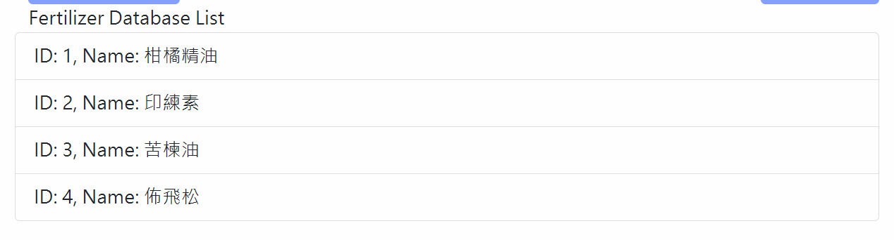

# 噴藥紀錄API使用說明 (To 佐翼)

> 更新記錄

20240815：將周老師團隊的回傳功能轉為由網頁端實作
20240926：依據計畫需求，新增藥肥重量登記機制，微調噴藥前、後的API參數，並且都相應修改sample code
                      噴藥前，新增藥肥重量參數`amount`、與`note`參數)、與`note`參數
                      噴藥後， 將`fertilizer_total_amount`名稱改為`total_water_used`)
>

## 陳世芳老師團隊

<aside>
⛅ **施藥歷史紀錄操作步驟**
1. 開始噴藥前Post 一次。資料庫登記起始時間(伺服器時間)、藥肥名稱、溫室資訊等內容。
2. 噴藥中定時Post。更新載具座標、剩餘藥量、電量等資訊。
3. 結束噴藥時Post 一次。資料庫更新結束時間(伺服器時間)、藥肥總量等資訊

</aside>

### 噴藥前

**主要使用API**

> `POST` http://digiag.bime.ntu.edu.tw:3000/spray/expData/
>
- Sample code (Python)

    ```python
    import requests

    url = "http://digiag.bime.ntu.edu.tw:3000/spray/expData/"
    headers = {
        "Content-Type": "application/json"
    }
    data = {
        "status": "start",
        "content": {
            "location": "Yizhu",
            "greenhouse": "B6",
            "fertilizers": [
                {"fertilizer_id": "3", "amount": 20.5},
                {"fertilizer_id": "1", "amount": 50.0}
            ],
            "note": "以200L的水、0.2L的柑桔精油、少量的活麗送稀釋而成"
        }
    }

    response = requests.post(url, headers=headers, json=data)

    if response.status_code == 200:
        print("Upload successful!")
    else:
        print(f"Upload failed with status code: {response.status_code}")
        print(response.json())

    ```


**參數說明**

- `status` :  **必填。**用來決定實驗開始(start) or 結束(end)
- `location` : **必填。**場地名稱，自定義字串(英文)
    - 義竹: Yizhu
    - 楊詠仁: Yang
    - 黃彥碩: Huang
    - 如有新增的合作場域再討論名稱
- `greenhouse` : **必填。**溫室名稱，自定義字串(英數)，如果有明確編號就登記編號(如義竹`B4`, `B6`等)，如果該場地只有一個溫室，使用數字`1`
- `fertilizers` : **必填、可多選**。肥料 / 農藥名稱，以及各自的用量(單位:克)，固體肥料or液態肥料都量測加入水缸的原始重量，目的是未來計算藥肥濃度時使用

    ```json
    "fertilizers": [
        {"fertilizer_id": "3", "amount": 20.5},
        {"fertilizer_id": "1", "amount": 50.0}
    ]
    ```

    以資料庫 **Table primary key ID** 作為代號使用 (具有唯一性，不會重複與改變)。使用前須先查詢目前系統資料庫上已存在的名單，如果不存在的話可進行手動新增

    - **查詢藥肥代號方法**
        1. API

            > `GET` [http://digiag.bime.ntu.edu.tw:3000/spray/fertilizers/](http://digiag.bime.ntu.edu.tw:3000/spray/fertilizers/)
            >
            - Sample code

                ```python
                import requests

                url = "http://digiag.bime.ntu.edu.tw:3000/spray/fertilizers/"

                response = requests.get(url)

                if response.status_code == 200:
                    print(response.json())
                else:
                    print(f"status code: {response.status_code}")
                    print(response.json())

                ```

                Response

                ```python
                [{'id': 1, 'name': '柑橘精油'}, {'id': 2, 'name': '印練素'}, {'id': 3, 'name': '苦楝油'}, {'id': 4, 'name': '佈飛松'}]
                ```

        2. 網頁介面查詢

            > 網址: [http://digiag.bime.ntu.edu.tw:3000/spray/](http://digiag.bime.ntu.edu.tw:3000/spray/)
            >

            最下方也有目前資料庫內容 (頁面排版仍在初期設計調整中)

            

    - **新增藥肥方法**

        > `POST` [http://digiag.bime.ntu.edu.tw:3000/spray/fertilizers/](http://digiag.bime.ntu.edu.tw:3000/spray/fertilizers/)
        >

        (和查詢網址相同)

        參數說明

        - `name`:  字串(可用中文)，要被新增的藥肥名稱
        - Sample code

            ```python
            import requests

            url = "http://digiag.bime.ntu.edu.tw:3000/spray/fertilizers/"
            headers = {
                "Content-Type": "application/json"
            }
            data = {
                "name": "佈飛松"
            }

            response = requests.post(url, headers=headers, json=data)

            if response.status_code == 200:
                print("Upload successful!")
            else:
                print(f"Upload failed with status code: {response.status_code}")
                print(response.json())

            ```


        註: 目前沒有設計學名 / 商品名的屬性登記，每個名字都是不同筆資料，需要新增時請謹慎使用，若有需要刪除的話再通知我們

- `note`：**選填**。備註這次噴藥的細節，例如藥肥的調配方式等 無法透過數值記錄的資訊。

    Ex (先前曾經提供)：以200L的水、0.2L的柑桔精油、少量的活麗送稀釋而成


---

### 噴藥中

**主要使用API**

> `POST` http://digiag.bime.ntu.edu.tw:3000/spray/vehicleData/
>
- Sample code (Python)

    ```python
    import requests

    url = "http://digiag.bime.ntu.edu.tw:3000/spray/vehicleData/"
    headers = {
        "Content-Type": "application/json"
    }
    data = {
        "uwb_coordinates": [100, 250],
        "battery_level": 80,
        "sprayed_pesticide": 30,
        "remaining_pesticide": 70
    }

    response = requests.post(url, headers=headers, json=data)

    if response.status_code == 200:
        print("Upload successful!")
    else:
        print(f"Upload failed with status code: {response.status_code}")
        print(response.json())

    ```


**參數說明**

- `uwb_coordinates` :  **選填**。List [x, y]。UWB座標(單位: m)
- `battery_level` :  **必填。**0~100，電池剩餘電量百分比，單位(%)
- `sprayed_pesticide` : **必填** 。≥0，這次試驗中已經噴灑的藥肥總量 (單位: 公升)。
- `remaining_pesticide` :  **必填。**≥0，目前藥桶剩餘的藥肥量 (單位: 公升)。

**更新頻率：暫定先依 10秒/次 上傳**

---

### 噴藥後

**主要使用API (同噴藥前網址)**

> `POST` http://digiag.bime.ntu.edu.tw:3000/spray/expData/
>
- Sample code (Python)。

    ```python
    import requests

    url = "http://digiag.bime.ntu.edu.tw:3000/spray/expData/"
    headers = {
        "Content-Type": "application/json"
    }
    data = {
        "status": "end",
        "content": {
            "total_water_used": 1000.5,
            "spray_target": [
                "yang-middle3",
                "yang-right1"
            ]
        }
    }

    response = requests.post(url, headers=headers, json=data)

    if response.status_code == 200:
        print("Upload successful!")
    else:
        print(f"Upload failed with status code: {response.status_code}")
        print(response.json())

    ```

    Response

    開始/結束時間為伺服器的系統時間，自動產生的

    ```
    Upload successful!
    {'location': 'Yizhu', 'greenhouse': 'B4', 'fertilizer': [1, 2], 'start_time': '2024-08-01T14:55:29.510454+08:00', 'end_time': '2024-08-01T17:57:48.936769+08:00', 'fertilizer_total_amount': 70.5}
    ```


**參數說明**

- `status` :  **必填。**用來決定實驗開始(start) or 結束(end)
- `total_water_used` : **必填。**噴藥過程最終耗費的藥肥總量，由流量計取得，單位(公升)
- `spray_target` :  **選填。**周老師定義的噴藥監測區域，目前只有在詠仁、彥碩溫室有設立

    ```
    楊詠仁溫室設備名稱
    yang-left1, yang-left2, yang-left3, yang-middle1, yang-middle2, yang-middle3, yang-right1, yang-right2, yang-right3

    黃彥碩溫室設備名稱
    huang-left1, huang-left2, huang-left3, huang-middle1, huang-middle2, huang-middle3, huang-right1, huang-right2, huang-right3
    ```


---

## 周呈霙老師

更新（0815）：以下都由台大陳世芳老師團隊進行處理就好，必要時佐翼團隊僅需回傳點位資訊

<aside>
⛅ 用途:
當收到LINE通知特定點位的蟲害數量過多時，需進行針對性 / 全場域的施灑，以下API作為回傳他們的蟲害監測平台，以記錄哪個點位有進行施灑，作為後續防治前/後的差異比較依據。

</aside>

API網址: https://asparagus.agriweather.tw/api/pest/tasks

- Sample code

    ```python
    import requests
    import json

    # 楊詠仁溫室設備名稱
    # yang-left1, yang-left2, yang-left3, yang-middle1, yang-middle2, yang-middle3, yang-right1, yang-right2, yang-right3

    # 黃彥碩溫室設備名稱
    # huang-left1, huang-left2, huang-left3, huang-middle1, huang-middle2, huang-middle3, huang-right1, huang-right2, huang-right3

    # 設備名稱
    name = 'huang-middle3'

    # 定義API端點URL
    url = "https://asparagus.agriweather.tw/api/pest/tasks"

    # 定義要發送的資料
    data = {
        "deviceHash": name,
        "status": "done"
    }

    # 定義HTTP標頭
    headers = {
        "Content-Type": "application/json"
    }

    # 發送POST請求
    response = requests.post(url, data=json.dumps(data), headers=headers)

    # 檢查回應狀態碼
    if response.status_code == 200:
        print("資料成功發送")
    else:
        print(f"發生錯誤: {response.status_code}")
        print(response.text)

    ```